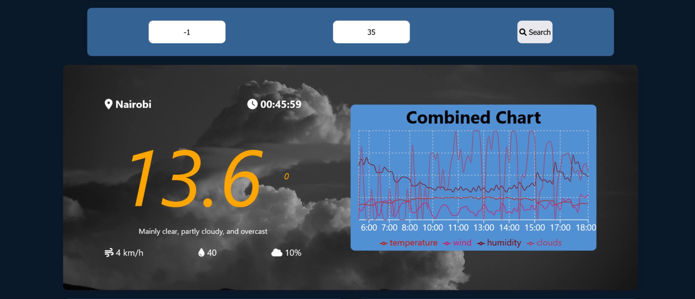
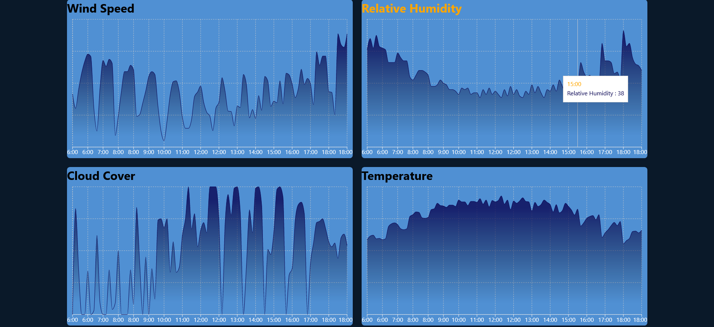

# Cyweather

Cyweather is A web app that allows a user to access and visualize hourly weather forecast data. The purpose of the application is to enable airstrip operators to make decisions and plans about their flight routines.

### By Tiberius Mairura, 24/06/2022

## Landing Page

## Forecasts Section

## Live Demo on 

[Youtube Video](https://youtu.be/pjMLm8xdYA0)

## Table of Content

- [Cyweather](#cyweather)
  - [Cyweather is A web app that allows a user to access and visualize hourly weather forecast data. The purpose of the application is to enable airstrip operators to make decisions and plans about their flight routines, 24/06/2022](#cyweather-is-a-web-app-that-allows-a-user-to-access-and-visualize-hourly-weather-forecast-data-the-purpose-of-the-application-is-to-enable-airstrip-operators-to-make-decisions-and-plans-about-their-flight-routines-24062022)
    - [By Tiberius Mairura](#by-tiberius-mairura)
  - [Landing Page](#landing-page)
  - [Forecasts Section](#forecasts-section)
  - [Live Demo on Youtube](#live-demo-on-youtube)
  - [Table of Content](#table-of-content)
  - [Description](#description)
  - [Features](#features)
    - [Requirements](#requirements)
    - [Installation Process](#installation-process)
    - [Live Link](#live-link)
    - [Technology  Used](#technology--used)
  - [Known Bugs](#known-bugs)
  - [Licence](#licence)
  - [Author's Details](#authors-details)

## Description

****
This single page application allows a user to fetch and nicely visualize hourly weather forecasts to help make decisions. The user is expected to provide [valid](https://gis.stackexchange.com/questions/88298/what-is-the-max-latitude-and-longitude-values-possible) coordinates, latitude and longitude, and once the data has been fetched, the application shows a forecast of four weather elements, wind speed, humidity and temperature. In addition, the user is able to view a complete summary of these weather elements in one chart.
****

[Go Back to the top](#Cyweather)

## Features

As a user you should be able to:

1. `Enter`  valid latitude
2. `Enter` valid longitude
3. `Submit` the values
4. `See` Summary of weather forecasts corresponing to the provided coordinates

5. ## OR

6. `Allow` GPS position so that you can get the weather forecasts for your current location automatically.

[Go Back to the top](#Cyweather)

### Requirements

- Access to  a computer, mobile phone or any other garget
- Internet access

### Installation Process

****

- Clone to this repo by running the command : `git clone https://github.com/hermitex/cyweather.git`
- Unzip the downloaded files in a folder of choice.
- Open the folder with your favorite CLI tool.
- Run `npm install` on your terminal from inside the root folder of the project
- Run `node server.js` on your terminal from inside the root folder of the project to run the server
- The server should run on `http://localhost:3000` by default
- If the port is busy, kindly feel free to change the port inside the server.js file
- Once the server is up and running, visit the link  `http://localhost:3000` to access the application
- Note that if you changed the port number, you will have a different port number on the link
- At this point, you will see the home page
- Great!!! Try to create some weather forecasts...
- You could also allow GPS when prompted to get the forecasts for your current location

 ****
[Go Back to the top](#Cyweather)

### Live Link

- Click this [link](https://cyweather.herokuapp.com/) to view the live application
  
****

### Technology  Used

- HTML -to develop the structure off the page

- CSS - to style the User Interface
- JavaScript - to manipulate the DOM and display appropriate data to the UI based on the use actions
- NodeJS - for successful deployment on Heroku
- ReactJS - Building component based UI
- [Weather Forecast API](https://open-meteo.com/en) - to facilitate fetching of weather forecast data

[Go Back to the top](#Cyweather)

****

## Known Bugs

- Sometimes the time for the weather forecast could be wrong

****

## Licence

MIT License
Copyright (c) [2022] [Tiberius Mairura]
Permission is hereby granted, free of charge, to any person obtaining a copy
of this software and associated documentation files (the "Software"), to deal
in the Software without restriction, including without limitation the rights
to use, copy, modify, merge, publish, distribute, sublicense, and/or sell
copies of the Software, and to permit persons to whom the Software is
furnished to do so, subject to the following conditions:
The above copyright notice and this permission notice shall be included in all
copies or substantial portions of the Software.
THE SOFTWARE IS PROVIDED "AS IS", WITHOUT WARRANTY OF ANY KIND, EXPRESS OR
IMPLIED, INCLUDING BUT NOT LIMITED TO THE WARRANTIES OF MERCHANTABILITY,
FITNESS FOR A PARTICULAR PURPOSE AND NONINFRINGEMENT. IN NO EVENT SHALL THE
AUTHORS OR COPYRIGHT HOLDERS BE LIABLE FOR ANY CLAIM, DAMAGES OR OTHER
LIABILITY, WHETHER IN AN ACTION OF CONTRACT, TORT OR OTHERWISE, ARISING FROM,
OUT OF OR IN CONNECTION WITH THE SOFTWARE OR THE USE OR OTHER DEALINGS IN THE
SOFTWARE.

[Go Back to the top](#Cyweather)
****

## Author's Details

Feel free to reach out via:

- StackOverflow Profile - [Tiberius Mairura](https://stackoverflow.com/users/11869442/tiberius)
- Linked - [Tiberius Mairura](https://www.linkedin.com/in/tiberius-mairura/)
- Dev.to - [Tiberius Mairura](https://dev.to/hermitex)

[Go Back to the top](#Cyweather)
****
